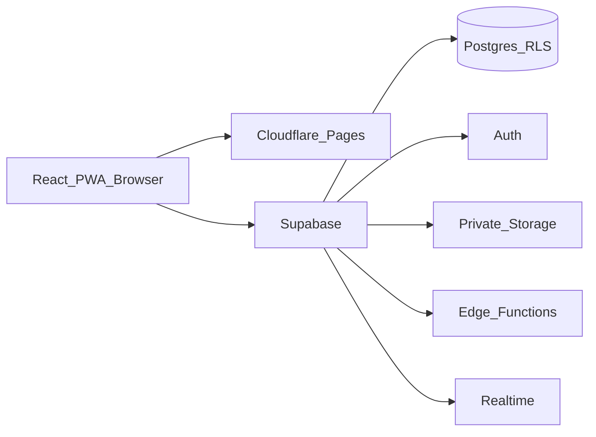
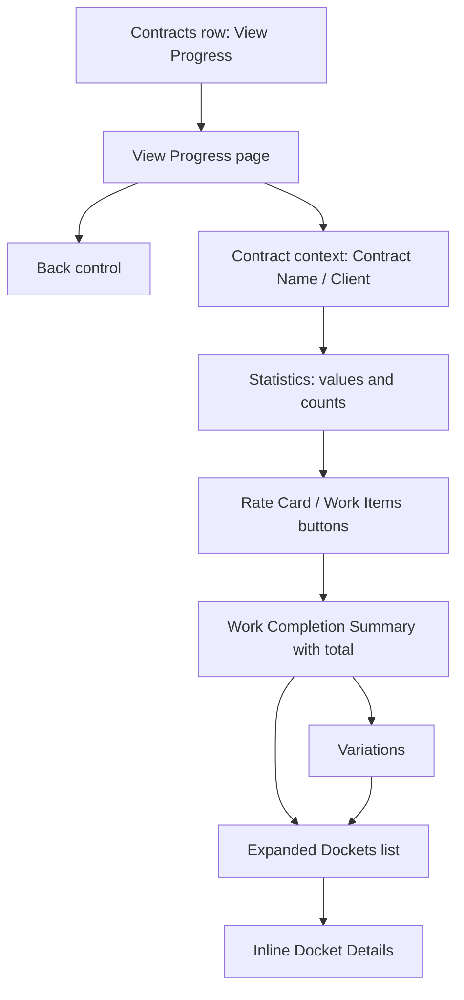
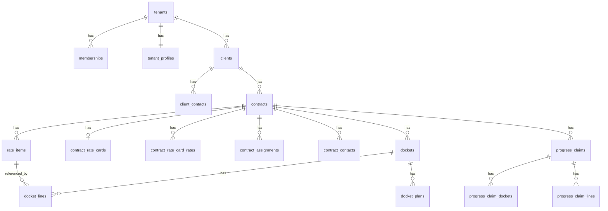

# DocketFlow — System Specification

**Status:** Current implemented system  
**Audience:** Product, engineering, and operations  
**Source of truth:** Application code, database migrations, RLS policies, and Edge Functions in this repository  
**Related docs:** [README.md](README.md) (setup overview), [DEPLOY.md](DEPLOY.md) (deployment), [CHANGELOG.md](CHANGELOG.md) (release history)

This document describes behaviour that is implemented today. Planned or aspirational features are omitted. Known limitations are listed in [§12](#12-known-limitations).

---

## 1. Purpose and scope

DocketFlow is a multi-tenant construction docketing SaaS for Australian building and construction workflows.

Field staff capture completed work and client signatures on site. Tenant administrators manage clients, contracts, work-item pricing, users, and progress claims. A separate platform control plane manages tenant lifecycle.

In scope:

- Tenant and platform authentication
- Clients, contracts, rate cards, work items, and assignments
- Docket creation, submission, offline sync, and viewing
- Progress analysis and progress claims
- Tenant administration and audit logging

Out of scope for this specification: future native-mobile (Capacitor) packaging, live Xero integration, and legal advice beyond the guidance already coded into claim due dates.

---

## 2. Terminology

| Term                 | Meaning in the product                                                                                                          |
| -------------------- | ------------------------------------------------------------------------------------------------------------------------------- |
| **Tenant**           | One customer organisation. All business data is keyed by `tenant_id`.                                                           |
| **Platform**         | Control plane for super admins (`/platform/*`). Separate from tenant business data.                                             |
| **Contract**         | A job of work for a client. Stored in table `contracts`; UI label is **Contracts**.                                             |
| **Work Item**        | A priced line on a contract schedule of rates. Stored in `rate_items`.                                                          |
| **Rate Card**        | Per-contract pricing defaults: staff-category rates by billing method, plus variation minimum quantity and variation item rate. |
| **Docket**           | A works record for a visit: selected work items, quantities, notes, plans, and client signature at submission. Begins as Draft. |
| **Draft docket**     | Status `draft`. Editable and deletable by its creator. Signature and client representative name/email are not required while drafting. |
| **Submitted docket** | Status `submitted`. Requires a client representative name, email, and signature to submit (phone optional). After submission, docket information cannot be changed (immutable). |
| **Progress claim**   | Period claim aggregating submitted, unclaimed dockets for a contract.                                                           |
| **View Progress**    | Contract progress / variation analysis UI (`/work-variations`).                                                                 |

Physical table names such as `contracts` and `rate_items` are retained for historical reasons; UI and this spec use Contract and Work Item.

---

## 3. System architecture



| Layer | Technology | Role |
|-------|------------|------|
| Frontend | React 19, TypeScript, Vite, Tailwind, React Router | SPA; feature modules under `src/features/` |
| Offline | PWA service worker, Dexie/IndexedDB, Web Crypto | Local drafts, contract cache, sync queue, encrypted signatures |
| Backend | Supabase (Postgres 15 locally / managed in prod) | Data, Auth, Storage, Realtime, Edge Functions |
| Hosting | Cloudflare Pages (`dist/`) | Static SPA |
| CI/CD | GitHub Actions | Lint, test, build; migrate and deploy functions on `supabase/**` changes |

There is no separate application API server. The browser talks to Supabase with the anon key; privileged operations use Edge Functions with the service role after caller checks.

Control plane and data plane are separated:

- Platform admins authenticate via `/platform/login` and manage tenants only.
- Tenant users authenticate via `/login` and operate within one tenant membership.

---

## 4. Actors and tenant lifecycle

### 4.1 Actors

| Actor                | Identity                               | Purpose                                                                 |
| -------------------- | -------------------------------------- | ----------------------------------------------------------------------- |
| Platform super admin | `platform_admins`                      | Create/update tenants; provision or reset the sole tenant administrator |
| Administrator        | Tenant membership role `administrator` | Full tenant configuration and commercial data                           |
| Supervisor           | `supervisor`                           | Contract lifecycle (full financial); Users / Clients / Organizational Settings (with Administrator fences); assign field technicians; create dockets; offline download |
| Field Technician     | `field_technician`                     | Personal Overview, My Contracts (assigned Active), My Dockets (own-created); create/submit dockets online/offline; no financial data |
| View Only            | `view_only`                            | Read selected commercial data; no writes                                |

Exactly one tenant administrator membership is enforced per tenant (partial unique index). A user may have only one membership globally. Platform admins do not hold tenant memberships for control-plane work.

### 4.2 Tenant status

Enum `tenant_status`: `active` | `read_only` | `disabled`.

| Status | Effect |
|--------|--------|
| `active` | Normal read/write when membership is active |
| `read_only` | Reads allowed; ordinary RLS writes blocked. UI shows a read-only banner |
| `disabled` | Business-table access cut off (`tenant_id()` returns null). Membership/tenant rows remain readable for messaging |

### 4.3 Membership lifecycle

- Invited or created users receive `memberships` + `profiles` via auth metadata / Edge Functions.
- Deactivating a user revokes sessions immediately and blocks RLS access for inactive memberships.
- The client monitors membership via Realtime, visibility changes, and periodic polling; deactivated users are signed out.

---

## 5. Roles and permissions

UI helpers live in `src/lib/roles.ts` and are backed by named capabilities in `src/lib/capabilities.ts` (`DEFAULT_ROLE_CAPABILITIES`). **RLS is authoritative**; pages hide actions but do not replace database checks. Route guards authenticate and enforce tenant/platform state; sensitive routes also use `RoleGate` role allowlists.

Coarse Settings capabilities today: `manage_users`, `manage_clients`, `manage_tenant_profile`, `manage_email_settings`, plus `view_audit_log` / `manage_claims` (Administrator only). SQL mirrors (`can_manage_users()`, `can_manage_clients()`, `can_manage_tenant_profile()`) use the same hard-coded role seeds. A future Tenant-Admin-only matrix may override role→capability without renaming these keys.

### 5.1 Capability matrix (application intent)

| Capability | Administrator | Supervisor | Field Technician | View Only |
|------------|:-------------:|:----------:|:----------------:|:---------:|
| Manage users / invites / activation / set password & recovery emails | ✓ | ✓² | | |
| Organizational Settings (firm identity, numbering, retention defaults, locale, etc.) | ✓ | ✓ | | |
| Email Settings (recipient defaults + docket sharing template) | ✓ | ✓ | | |
| View audit log | ✓ | | | |
| View clients (Clients nav / page) | ✓ | ✓ | | ✓ |
| Create / edit clients and contacts | ✓ | ✓ | | |
| View Active contracts list | ✓ | ✓ | | |
| View Completed / Inactive contracts | ✓ | ✓ | | ✓ |
| Create / edit contracts | ✓ | ✓ | | |
| View financial contract / work-item fields | ✓ | ✓ | | ✓ |
| Edit work items | ✓ | ✓ | | |
| Open Work Item Details | ✓ | ✓ | | |
| View Work Items list (ops quantities) | ✓ | ✓ | ✓ | |
| View rate cards | ✓ | ✓ | ✓¹ | |
| Edit rate cards | ✓ | ✓ | | |
| View Progress analysis | ✓ | ✓ | | ✓ |
| Assign field technicians | ✓ | ✓ | | |
| My Contracts (assigned Active) | | | ✓ | |
| Create dockets | ✓ | ✓ | ✓ | |
| Download contracts for offline | ✓ | ✓ | ✓ | |
| View own dockets only | | | ✓ | |
| Manage progress claims | ✓ | | | |
| View progress claims | ✓ | | | ✓ |

¹ Field technicians may **read** Rate Card header + staff rows for assigned Active contracts (needed to add Variation items on Create Docket). They cannot open the Rate Card page or edit rates. On Create Docket, Staff Category dropdowns show category names only (no $) for all roles.

² Supervisors manage non-Administrator users only: cannot assign `administrator`, cannot edit/deactivate/reset/delete an Administrator, and cannot change their own role or deactivate themselves. Never-signed-in users may be hard-deleted (not deactivated). Sole-admin / unique-admin invariants still apply. Audit Log and Progress Claims remain Administrator-only.

Supervisor objective: run the contract lifecycle (create/edit Active, Completed, Inactive contracts; work items with rates; rate cards; View Progress) and allocate staff so field technicians can create dockets. Supervisors also manage **Users**, **Clients** (all statuses), and **Organizational Settings** (firm identity, numbering, retention defaults, locale, etc.) subject to Administrator fences above. Supervisors see financial fields and may download contracts for offline docketing. Audit Log and Progress Claims remain administrator-only.

Field technicians work a personal scope: **My Contracts** (assigned Active only), **My Dockets** (own-created drafts/submitted only), and a personalized Overview. They may open Contract Details / Work Items for assigned Active contracts (ops quantities only — no Rate Card page, Staff Allocation, View Progress, or financial work-item fields). For Create Docket they may read Rate Card header + staff category rows on assigned Active contracts so Variation items can be priced (UI hides $). Administrators and supervisors may create dockets without the same assignment restriction (subject to RLS job-visibility rules). RLS `can_view_job`: supervisors → all tenant jobs (like administrator); field technicians → assigned **and** Active. `rate_item_progress` nulls rate/value columns for field technicians only; `rate_item_progress_ops` is the non-financial projection. Docket SELECT for field technicians is `worker_id = auth.uid()` only; `docket_lines` / `docket_plans` SELECT follows parent docket visibility.

### 5.2 Primary navigation

Shown in `AppLayout` when permitted:

- Overview (`/`) — analytics home (stat tiles and recent grids); replaces the former Home launcher
- Contracts (`/jobs`) — administrator, supervisor
- My Contracts (`/field/jobs`) — field technician
- Dockets (`/dockets`) — administrator, supervisor, view_only; field technicians see the same route labelled **My Dockets**
- Users, Clients, Organizational Settings, Email Settings — administrator and supervisor (`manage_*` capabilities); Audit Log — administrator only; Clients also for view_only (read). The **Settings** heading appears when at least one of those links is visible (field technicians see none).

**Not in primary nav (routes exist):** Progress Claims (`/progress-claims*`), View Progress (`/work-variations`), Contract Details (`/jobs/:id/details`), Staff Allocation (`/jobs/:id/staff-allocation`), Rate Card (`/jobs/:id/rate-card`). These are reached by deep links or in-page actions (e.g. open Contract Details from a contract row; Work Items / Rate Card / Staff Allocation / View Progress / Create Docket from Contract Details). Field technicians may open Contract Details and Work Items for assigned Active contracts; Rate Card, Staff Allocation, Work Item Details, and View Progress remain denied for field technicians.

---

## 6. Functional workflows

### 6.1 Authentication and onboarding

| Route | Purpose |
|-------|---------|
| `/login` | Tenant sign-in |
| `/platform/login` | Platform super-admin sign-in |
| `/set-password` | Invite / recovery password setup |
| `/change-password` | Forced password change |
| `/profile` | Profile self-service (name, contact details) |

Behaviour:

- Separate tenant and platform sessions / gates (`ProtectedRoute`, `PlatformProtectedRoute`).
- Forced password change and incomplete profile can block normal app use until resolved.
- Disabled tenants and inactive memberships prevent business use; read-only tenants allow viewing with a banner.
- Invite emails are sent by Supabase Auth; the hosted **Invite user** template should use invite metadata (`firm_name`, `role_label`, `full_name`) so messages mention DocketFlow, the organisation, and role (see `DEPLOY.md`).
- Administrators and supervisors may set a password or send a recovery/set-password email from Users (Administrator memberships excluded); `/set-password` remains the email landing route; forced change uses `/change-password` when `must_change_password` is set.

### 6.2 Platform administration

| Route | Behaviour |
|-------|-----------|
| `/platform/tenants` | List / create tenants |
| `/platform/tenants/:id` | Edit name and status; manage sole tenant administrator (create / invite / reset) |
| `/platform/account` | Platform admin account settings |

No tenant deletion UI. Platform audit rows are written in the database; there is no platform audit-log UI.

Edge Functions: `platform-tenants`, `platform-tenant`, `platform-tenant-admin`.

### 6.3 Tenant administration

| Area           | Route                   | Behaviour                                                                                                                         |
| -------------- | ----------------------- | --------------------------------------------------------------------------------------------------------------------------------- |
| Users          | `/admin/users`          | Administrator and Supervisor (`manage_users`). Create with password or email invite. **Team members** show status badges from Auth `last_sign_in_at` + `memberships.is_active`: **Pending** (amber, never signed in), **Active** (green), **Inactive** (red). Never-signed-in users: **Delete** (hard-delete auth so email can be reused; blocked if Staff Allocation exists) — not Deactivate. After first login: **Deactivate** / **Activate** only (no Delete). **Pending invites** list email invites not yet completed (invitees are not dual-listed under Team members until first login / invite cleared); **Resend invite**, **Cancel invite** (same hard delete), **Expired** badge after 24h from invite `created_at`; Set password on invite or member. Hard fences: never assign/edit/reset/delete Administrator; callers cannot change own role or deactivate themselves |
| Organizational Settings | `/admin/tenant-profile` | Administrator and Supervisor (`manage_tenant_profile`). Firm identity, logo, GST treatment, payment terms, retention defaults, currency, Contract No / docket number prefixes and next numbers, plus **Time Zone & Locale** settings (IANA timezone; DST handled automatically) |
| Email Settings         | `/admin/email-settings` | Administrator and Supervisor (`manage_email_settings`). Default docket sharing recipients + docket sharing email template (subject + HTML body). |
| Settings       | `/admin/settings`       | Redirects into Organizational Settings / parameters area                                                                                   |
| Audit Log      | `/admin/audit`          | Tenant audit entries (Administrator only)                                                                                                              |

Assignable roles (cannot assign `administrator` via Create User): Supervisor, Field Technician, View Only.

Edge Functions: `create-user`, `invite-user`, `set-user-active`, `manage-tenant-user` (actions: `list`, `set_password`, `resend_invite`, `send_recovery`, `delete_user`, `cancel_invite`). Callers use `supabase.functions.invoke` (session JWT + anon `apikey`). Caller must have `manage_users`; same Administrator / never-signed-in / assignment fences server-side.

### 6.4 Clients and contacts

Route: `/clients`.

- Administrator and Supervisor create/edit (`manage_clients`); both see **all** client statuses (Active and Inactive). View-only can view all statuses.
- Client fields include name, optional client code, ABN, address, Xero Contact ID (**reference only**), active/inactive status.
- Contacts: primary contact, phone, up to three emails. Additional emails are stored as contact rows with empty phone (labels such as Contact Email 2/3).
- At most one primary contact; sole contact is primary; deleting primary promotes another contact.

### 6.5 Contracts

Route: `/jobs` (label **Contracts**).

- Administrator and supervisor create contracts with **New Contract** (leading plus icon) on the Contracts list. The create panel heading is **New Contract**.
- New Contract fields use a responsive two-column layout (one column on narrow screens). Identity row is **Contract No** (`contract_number`; editable, required, unique per tenant, prefilled from **Next Contract No**) and **Contract Name** (`project_name`; required). Lists/grids display Contract No with optional **Contract Number Prefix** (display-only). A full-width rule follows, then a **Client** section heading (same style as Contract Administrator / Site Manager): **Client Name**, **Billing type**, head-contractor fields when applicable, Client PO no, and Site address. **System Contract No** (`job_number`) is allocated on save and not shown in the UI. When Billing type is not Head Contractor, Subcontract Agreement No and Head Contractor Project No remain visible, disabled, and labelled **Not used**.
- After **Site address**, optional **Contract Administrator** and **Site Manager** blocks (Name, Phone, Email each) sit between horizontal rules (extra space above the top rule). Stored in `contract_contacts` (one row per role per contract). Empty roles are not stored. Invalid emails (when entered) block Save. Intended for later docket PDF email sharing.
- Save is disabled until all required fields are complete and entered values are valid. Every validation issue (and any save error) is listed above the button row. Cancel remains available while saving is idle.
- Clicking a contract row/card opens **Contract Details** at `/jobs/:id/details` (no inline expansion editor).
- Grid/card column **Contract No** shows the formatted business number (prefix + number when prefix is set). Grid/card column **Contract Name** shows `project_name`.
- Grid/card column **Date** shows the contract date.
- Visible statuses used in UI: **Active**, **Inactive**, **Completed**. Administrators and supervisors see Active, Completed, and Inactive sections (RLS `can_view_job` grants supervisors the same status breadth as administrators).
- **Active Contracts** grid/cards include a **Staff** count: distinct users on `contract_assignments` whose tenant membership role is `administrator`, `supervisor`, or `field_technician` (same rule as Contract Details **Staff Assigned**; `view_only` excluded). Completed and Inactive grids omit Staff.
- Financial columns (Estimated / Calculated / Completed Value) are shown to roles with `canViewFinancials` (administrator, supervisor, view_only).
- Contract start/end dates exist in the schema; current create/edit UI does not collect them.
- Supervisor assigns staff (Administrator / Supervisor / Field Technician) via **Staff Allocation**.
- Actions: **View Contract** (eye → `/jobs/:id/details`) for all Contracts viewers; **View Progress** (chart → `/work-variations?contract=:id`) when `canViewProgress`; **Download offline** / **Re-download offline** for administrator and supervisor (explicit cache; not pruned by field-assignment rules). Field technicians use My Contracts download instead.

#### Contract Details

Route: `/jobs/:id/details`.

- Heading **Contract Details**, contract name as subheading, then `Client: <name>` and `Staff Assigned: <count>`.
- **Staff Assigned** is the count of distinct users on `contract_assignments` whose tenant membership role is `administrator`, `supervisor`, or `field_technician` (`view_only` excluded).
- No upper-left Back control.
- Action buttons (leading icons before labels): **Work Items** (→ `/jobs/:id`); **Rate Card** (administrator/supervisor → `/jobs/:id/rate-card`); **Staff Allocation** (administrator/supervisor → `/jobs/:id/staff-allocation`); **View Progress** (when `canViewProgress` → `/work-variations?contract=:id`); **Create Docket** (→ `/dockets/new?contract=:id&from=contracts` for admin/supervisor, `&from=field` for field technicians) when the user can create dockets and the contract is Active; **Download offline** for administrator/supervisor.
- Contract fields follow the create/edit field set (including editable **Contract No**, **Contract Name**, **Client** section, and **Contract Contacts**). Financial fields (Estimated Contract Value, Calculated Contract Value, Retention Rate, Retention Cap) show for `canViewFinancials` roles. Field technicians do not see them and select ops/allowlisted contract columns (not `*`). Contract Contacts remain visible (read-only) to field technicians.
- Field technicians opening a non-Active (or unassigned) contract are redirected to `/field/jobs`.
- Read mode bottom controls: **Back** (arrow, to `/jobs` for admin/supervisor, `/field/jobs` for field) and role-gated **Edit** (pencil, administrator or supervisor).
- Edit mode bottom controls: **Back**, **Save** (floppy; disabled until dirty), and **Cancel** (X; enabled). Cancel restores the saved snapshot and returns to read mode; Save persists via the shared contract save helper and reloads the page data.
- Status (Active / Inactive / Completed) is edited on this page, not in the Contracts grid.
- Field technicians see only **Work Items** and **Create Docket** actions (no Rate Card, Staff Allocation, View Progress, or Download offline on this page).

#### Staff Allocation

Route: `/jobs/:id/staff-allocation`.

- Opened from Contract Details **Staff Allocation** (administrator or supervisor).
- Heading `Staff Allocation - <contract name>`, then `Client: <client>` and live `Total Staff Allocated: <count>` based on the current checkbox selection (including unsaved changes).
- **Allocate Staff** grid lists every active tenant membership with role `administrator`, `supervisor`, or `field_technician` (excludes `view_only`), sorted by profile full name.
- Columns: Checkbox (assigned to this contract), Name (profile full name), Role (role label from the roles table), Contracts (total contracts assigned to that user, including this contract when checked).
- Checkbox changes are staged locally. Checking allocates; unchecking deallocates. Totals update immediately. Only users already in `contract_assignments` start checked (no auto-check for Admin/Supervisor).
- Assignment continues to gate Field Technicians only (My Contracts / Create Docket / RLS). Administrators and supervisors retain full contract visibility whether or not they are checked; allocating them is optional bookkeeping.
- Bottom controls: **Back** (leading back-arrow icon, to Contract Details), **Cancel** (X icon), and **Save** (floppy icon). Cancel and Save are disabled until the selection differs from the loaded snapshot. Cancel restores the snapshot; Save applies the assignment insert/delete diff and reloads.
- Assignment management is not available on the Work Items page.

System Contract No (`job_number` / `job_number_label`) is a pure per-tenant integer sequence, unique and immutable after allocation; it is not displayed in the UI. Business **Contract No** (`contract_number`) is unique per tenant, editable after save, driven by tenant **Next Contract No** (with bump when a used/higher value is saved); tenant **Contract Number Prefix** is display-only in the UI.

### 6.6 Rate cards

Route: `/jobs/:id/rate-card`.

- One rate-card header per contract: **Variation Item Minimum Hours** (`variation_minimum_qty`), **Default Variation Item Rate per Hour** (`variation_item_rate`).
- Rate rows: staff category (free text) × billing method → rate. Row action uses an icon-only trash control (**Delete**) with accessible label.
- Header action **Add Rate** uses a leading plus icon.
- No top-left back link. Bottom controls: history-aware **Back** (arrow; previous in-app location when available, otherwise Contract Details), dirty-aware **Save** (floppy), and **Cancel** (X) for editors.
- View: administrator or supervisor. Edit: administrator or supervisor.
- Changing a Staff Category **rate** amount later updates live valuations for Variation items that reference that row. **Rename** and **delete** of a staff row are blocked while any Work Item references `rate_card_rate_id`. Clearing header Default Variation Item Rate per Hour / Variation Item Minimum Hours is blocked while docket-created Variation items depend on the header fallback (no staff row).
- Offline contract download caches Rate Card header + staff rows for Variation-item creation on dockets.

### 6.7 Work items

Route: `/jobs/:id` (page title **Work Items**).

Header shows `Contract: <project> (<formatted Contract No>)` and Client.

The header action is **New Work Item** with a leading plus icon (administrator or supervisor). The page has no top back link; its bottom **Back** button (leading back-arrow icon) returns to Contract Details at `/jobs/:id/details`.

Field technicians may view the Work Items grid (item identity, type, billing, est/completed/remaining qty, status) but **do not** see Agreed Rate or Var Rate columns, cannot create work items, and cannot open Work Item Details (rows are not clickable; deep links redirect). They load `rate_item_progress_ops`. Administrators and supervisors see financial rate columns, may create/edit work items, and may open Work Item Details.

New Work Item form (administrator or supervisor) uses a responsive two-column layout (one column on narrow screens):

| Field            | Notes                                                                                                                                                                                                                                                          |
| ---------------- | -------------------------------------------------------------------------------------------------------------------------------------------------------------------------------------------------------------------------------------------------------------- |
| Item Number      | Required                                                                                                                                                                                                                                                       |
| Cost Code        | Optional                                                                                                                                                                                                                                                       |
| Item Description | Required                                                                                                                                                                                                                                                       |
| Item Category    | Required. Select Contract Item, DA Condition, or Optional Item. Variation is not offered for new items; an existing Variation-category item may keep that category when edited. |
| Billing Method   | Editable for non-variation; locked to Per Hour for Variation (legacy items)                                                                                                       |
| Agreed Quantity  | Required; lump sum locked to 1; variation defaults/validates against rate-card minimum for legacy Variation items                                                                 |
| Agreed Rate      | Manual entry for non-Variation items. Staff Selection is not shown on the form (Rate Card staff→rate helpers remain for legacy stored links). For Variation items, locked to the Rate Card Default Variation Item Rate per Hour. |
| Variation Rate   | Optional for Contract / DA / Optional items; used when progress exceeds agreed quantity (excess × Variation Rate). Unused for Variation-category items (not applied). |
| Budgeted Value   | Computed `quantity × agreed rate`; locked                                                                                                                                         |
| Item Status      | Required                                                                                                                                                                          |
| Notes            | Optional                                                                                                                                                                          |

Staff Selection is not shown on the create/edit form for Contract/DA/Optional items. Legacy `rate_card_rate_id` / `staff_category` are preserved on save when still present in form state. Progress grid and View Progress use Variation Rate for excess-quantity valuation on non-Variation items when set.

Variation Trigger remains in the database and is maintained by rules/triggers; it is not exposed in the create form.

Field presentation uses clear locked / not-used / invalid states while creating or editing. Save remains disabled until editable required values are valid.

Progress grid shows item number, description, type, billing, quantities, rates, completed/remaining, status, and an **Action** column. **Variation** type is visually emphasized. For Variation-category rows with a creating docket, Action includes a **Docket** icon that opens that docket (creator’s draft edit URL while draft; otherwise docket detail). Desktop rows and mobile cards are clickable (keyboard-activatable) and navigate to `/jobs/:id/work-items/:workItemId`, matching the Action eye icon (**View Work Item** hover/accessibility text). Completed quantity is derived from **submitted** docket lines only (`rate_item_progress` view).

**Variation Work Items from Create Docket** are not created from this form (category remains hidden for new items). Those rows use `estimated_qty = 0`, null `agreed_rate`, store Staff Category / `rate_card_rate_id` when selected, and set `created_from_docket_id`. Work Item Details shows an explainer for these rows; Agreed Qty/Rate appear unused.

**Work Item Details** uses `/jobs/:id/work-items/:workItemId`. It shows the parent contract and client context and reuses the same work-item fields and validation rules in a responsive two-column layout (one column on narrow screens). In read mode, fields are greyed out without Locked / Not used badges or validation cursor styles. In edit mode, Locked / Not used labels and semantic cursor/validation styles appear as on create. Read mode has bottom **Back** and **Edit** buttons. Edit mode has bottom **Back**, dirty-aware **Save**, and **Cancel** buttons; all use consistent leading icons. Back returns to the parent Work Items page.

### 6.8 Field assignments and My Contracts

- Assignments stored in `contract_assignments` (unique per contract/user).
- Administrators and supervisors manage assignments on **Staff Allocation** (`/jobs/:id/staff-allocation`); see Section 6.5. The list includes Administrators, Supervisors, and Field Technicians; assignment is required for Field Technician My Contracts access and does not restrict Admin/Supervisor contract visibility.
- Field technicians use **My Contracts** at `/field/jobs`: grid of assigned **Active** contracts (Contract No, Contract Name, Site Address, Actions). Row/eye opens Contract Details; **Create Docket** uses `from=field`; offline download/re-download is a secondary control. No contract value / financial columns.
- Field offline cache stores non-financial contract headers plus `rate_item_progress_ops` (not full `rate_items` rate rows). Caches for unassigned or inactive contracts are pruned on the field page only.
- Administrators and supervisors download from **Contracts** list or **Contract Details**; those caches use financial contract headers plus `rate_item_progress` when `canViewFinancials`, and are not pruned by field-assignment rules.

### 6.9 Docket creation

Route: `/dockets/new` with optional query params:

- `contract=<id>` — preselect contract
- `from=contracts` | `from=field` | `from=overview` — locks client/contract selection and sets back navigation
- `draft=<id>` — resume a local/server draft

Steps:

1. **Select** — choose client/contract (unless locked), then select **active Contract / DA / Optional** work items only (Variation-category items are never listed). Grid: Item No, Type, Description, Agreed, Completed, Remaining, Variation Status. **Continue** is allowed with zero selected items (confirm dialog: docket will only include Variation items added next). Locked selection shows Client, Client PO No, and Contract No. Sticky subheading is the contract name. Bottom **Back** / **Continue** as before.
2. **Lines (New Docket)** — heading **New Docket** with contract-name subheading. Enter worked quantities on selected lines; below Docket Lines, **+ Add Variation Item** opens a Variation Items grid (Item No suggest `V1`…, Category locked Variation, Description, Staff Category from Rate Card `per_hour` rows or Default Variation Item Rate per Hour fallback, Quantity hrs ≥ Rate Card Variation Item Minimum Hours or 1, notes, Save/Discard/Edit/Delete icons). The **+ Add Variation Item** trigger is hidden while the Variation editor is open (add or edit) and returns after Save or Discard (same pattern as **+ Add Plan**). Variation-only dockets are allowed. Incomplete Variation editor blocks Save Draft / Sign Off / Submit. Staff Category dropdown shows category names only (no rates/$) for all roles. Then **Total Hours Today**, **Docket Comments**, **Plans Used**; **Client Sign Off** (representative name, email, optional phone, and signature); save draft or submit.

Quantity behaviour:

- Per hour: user enters hours in the **Worked** column.
- Per visit / lump sum: worked quantity is fixed by billing method (e.g. 1 visit / lump sum).

Lines grid columns: Item No, Type, Item Description, **Worked**, **Agreed QTY**, Completed with Today, **Remaining**, **Status**, Actions. Actions use icon-only **Add Notes** (note document with a plus when the line has no note; lined note document when a note exists) and **Delete** controls.

Item Notes panel: **Add Note** (save icon), **Delete Note** (trash icon), **Cancel** (X icon).

**Total Hours Today** sums per-hour **Worked** quantities plus Variation item hours on this docket. When the sum is 0, the value is **N/A** in grey (not an em dash).

**Docket Comments** is a textarea on the Lines step (stored as docket `notes`). The input label uses the same black/semibold `.label` style as **Date**.

Plans Used: **+ Add Plan** is hidden while adding or editing a plan (returns after Save or Cancel). The form has Item / Drawing No fields with icon-only **Save** and **Cancel** on the right of the input row (same pattern as Variation Items); grid row actions are icon-only **Edit** and **Delete**.

Client Sign Off: helper text **Enter Client Representative details.** Fields **Representative Name** (required), **Email** (required; generic email format), **Phone** (optional). These values belong to the docket only (not client or contract contacts) and are stored on Submit (`client_rep_name`, `client_rep_email`, `client_rep_phone`). A non-empty invalid Email shows a red border and **Email is not valid.** Submit stays visible and is disabled until name, valid email, and signature are present. The signature pad shows grey **Signature** until ink is entered; **Clear Signature** appears only while the pad is not empty. **Cancel** and **Submit** use leading cancel and submit icons.

After **Save as Draft**, navigation returns to the **create origin** (same destinations as create Back: Contract Details when `from=contracts`, My Contracts when `from=field`, Overview when `from=overview`, otherwise Dockets).

After **Submit**, navigation opens the submitted docket’s full detail at `/dockets/:id`, carrying create-origin state so Detail **Back** returns to that origin. The list is not the default landing after Submit.

While offline (or before the server assigns a number), the working Docket No field on New Docket shows a **preview** of the next number when known, otherwise **Pending sync**. Sync status pills (**Queued**, **Pending sync**, **Sync Error**) are not shown on the Create / New Docket heading. The real Docket No is allocated on server insert (`allocate_docket_number`); sync writes the label back locally.

Variation caution:

- Select step shows a red banner when selected items are **already at limit or already in variation** relative to agreed quantity (prior submitted progress). Selecting such an item will generate variation on this docket. Reaching the limit only after this docket’s quantity is entered is not a Select-step caution.
- On Continue, a confirmation dialog may be required when that Select-step caution is showing; title is caution icon + **Variation Work**.
- Lines step shows the same style of banner between **Docket Lines** and the grid only when completed-with-worked quantities **exceed** agreed quantity (`is_variation`), including newly entered worked values. Status **At Limit** (completed-with-today equals agreed) does not show the banner.

Variation math (client and DB must agree):

```
remaining = max(0, estimated_qty - completed_qty)
variation_qty = max(0, line_qty - remaining)
is_variation = (completed_qty + line_qty) > estimated_qty
```

`completed_qty` for this calculation is submitted progress only. Full user quantity is stored on the line; excess beyond remaining agreed quantity is `variation_qty`.

Docket-created Variation-category items use `estimated_qty = 0` / null `agreed_rate`, so all worked hours are variation quantity. They are created as real `rate_items` with `created_from_docket_id`, synced with the draft (including offline queue + Item No auto-suffix on collision). Deleting a draft deletes orphan Variation items created for that docket. Field technicians may insert/update/delete only Variation items on their own draft dockets (RLS). After submit, Variation item quantity is immutable via the docket; admin/supervisor may still edit description/staff/status on Work Item Details.

Non-Variation items retain the excess-work behaviour above.

Submission requires client representative name, email, and signature (phone optional). Submitted dockets become immutable; `signed_at` is set on transition to submitted. Docket numbers allocate from tenant counters (may show “Pending sync” offline until reconciled).

If neither Staff Category `per_hour` rates nor Default Variation Item Rate per Hour are available on the Rate Card, **+ Add Variation Item** is blocked with: *No Rate Card information available for the contract to create variation items.*

### 6.10 Docket list and detail

Route: `/dockets`, `/dockets/:id`.

- Page title **Dockets** for admin/supervisor/view_only; **My Dockets** for field technicians.
- Field technicians see only dockets where `worker_id` is themselves (server query + local IndexedDB filter). RLS enforces the same for online reads; peer docket deep links fail.
- Header action **Create Docket** uses a leading plus icon.
- Submitted section with filters (client, contract, staff, date range, search, **Variation Status**). Staff filter is hidden for field technicians (always self). Variation Status options: All Dockets, Dockets With Variations, Dockets Without Variations. A variation docket has ≥1 line with `is_variation` or `variation_qty > 0`. Deep link `?variationStatus=with|without` initializes that filter (Overview **View All Variations** uses `with`) and **opens** the Filters panel.
- Filters sit in a collapsed-by-default disclosure under Submitted Dockets (**Filters** toggle). Applied filters show as dismissible chips. The default one-month **Start Date** window always shows a **Last month** chip (clearing it with × shows all submitted dockets; **Reset** restores the default window). Other non-default filters (client, contract, staff, custom start/end dates, search, variation status) add their own chips. **Reset** (reset icon) is enabled when any filter differs from page defaults and also clears `variationStatus` from the URL. Expanding Filters shows the same field set in a denser grid.
- Submitted grid actions use icon-only **View** (eye) and, when the docket is **complete for PDF**, icon-only **View PDF**. Draft grid actions use icon-only **Edit** and **Delete**. Overview and View Progress do not show a PDF action.
- Drafts listed separately; creator can edit/delete drafts. Draft detail shows **Delete Docket** with a trash icon for the creator. Drafts never show View PDF.
- Sync badges: orange **Queued**, orange **Pending sync** (when Docket No is still pending), and red **Sync Error** when applicable — shown together when more than one applies (Dockets list rows and Docket Detail). Not shown on Create / New Docket.
- Full-page detail (`/dockets/:id`) has no top-left Dockets link. Submitted sticky title is **Docket - {docket_number_label}**; drafts keep **Draft Docket**. Bottom-left **Back** (leading back-arrow icon) returns to create origin when present (after Submit from create), otherwise to the previous in-app location when history exists, otherwise `/dockets`. Embedded detail (View Progress) omits this chrome and has no View PDF control.
- Detail shows lines, **Total Hours Today** (**N/A** in grey when there are no per-hour hours), **Docket Comments**, plans, and signature when available online.
- **View PDF** (full detail only, submitted): bottom **View PDF** button with leading PDF icon beside **Back**. Enabled when the docket is complete for PDF: real Docket No (not Pending sync), sync settled (not Queued/error/local-only), online, and signature image loadable. When not ready, the button remains visible but **disabled** with adjacent text **Offline**. After sync completes (or the app comes online and sync succeeds), detail refreshes in place so View PDF can enable without a manual full navigation.
- PDF is generated **on demand in the browser** (A4). It is **not stored** in Storage or the database. On click: open in a new tab and download `Docket-{docket_number_label}.pdf`. Header includes Organizational Settings **firm name**, **registered address**, **phone**, and **email** when present (no logo in the current release). Body includes all Docket Detail content (header fields, lines with notes and variation status, Total Hours Today as **N/A** when there are no per-hour hours, Docket Comments, Plans Used, client representative name/email/phone, signature, signed date/time). Anyone who can open the submitted docket may View PDF when complete, including when the tenant is read-only.

### 6.11 View Progress

Route: `/work-variations?contract=<contract-id>`.

Read-only per-contract progress analysis. Not shown in primary navigation. Opened from a **View Progress** action on Contract rows (`/jobs`) or from Contract Details. Direct access without `contract` shows guidance to open it from Contracts.

A bottom **Back** control (leading back-arrow icon) returns to the previous in-app location when history exists; otherwise it falls back to Contracts (`/jobs`). There is no top-left back link. Above **Work Completion Summary**, **Rate Card** and **Work Items** buttons (with leading Rate Card and Work Items icons) navigate to `/jobs/{contract-id}/rate-card` and `/jobs/{contract-id}` for the same contract.

#### Purpose

Show how Work Items on one Contract are progressing: agreed vs completed quantities, contract-capped valuation, excess/variation valuation, and drill-down from a Work Item into submitted dockets and full docket detail.

#### Access and permissions

- Authenticated tenant users with `canViewProgress` can open the route (administrator, supervisor, view_only). Field technicians are redirected away.
- Contract visibility follows RLS (`can_view_job`): administrators and supervisors see all tenant contracts; view-only see non-draft/non-archived contracts; field technicians see assigned **Active** contracts.
- Practical entry from Contracts is available to administrators and supervisors (and other `canViewProgress` roles that reach Contracts).
- Page remains usable when the tenant is read-only (no writes).

#### Wireframe blueprint



Layout top to bottom when submitted dockets exist:

1. Page title **View Progress**
2. Contract context (**Contract Name**, **Client**)
3. **Statistics: {contract name}**
4. **Rate Card** and **Work Items** buttons (leading icons)
5. **Work Completion Summary** with right-aligned section total (includes contract valuation columns)
6. **Variations ({count})** with right-aligned section total
7. Bottom **Back** (leading back-arrow icon)

Desktop (`lg+`): tables. Below `lg`: card lists.

**Work Completion Summary** and **Variations** are each one unified non-collapsible grid/card list. Rows in both grids sort by Item Number (natural/numeric-aware).

#### Data sources

Loaded for the selected contract:

- Contract header (`contract_number`, `project_name`, client name)
- `rate_item_progress` (agreed/completed/remaining/variation quantities and rates)
- Contract estimated and scheduled values
- Submitted dockets and docket lines for drill-down
- Contract assignments (for Field Technicians count)
- Worker display names from profiles

Progress quantities are based on **submitted** docket lines. Changing `contract` resets loaded data and expanded rows.

#### Statistics

Two-column definition list.

Value metrics:

| Label | Meaning |
|-------|---------|
| Estimated Value | Contract `contract_estimated_value` |
| Scheduled Value | Contract `contract_value` (sum of work-item budgets) |
| Current Contract Value | Sum of contract-capped item valuations; shows `/ Scheduled Value` when scheduled value exists |
| Current Variations Value | Sum of excess × Variation Rate for non-Variation items, plus completed × live Rate Card unit price for Variation-category items |
| Total Current Value | Current Contract Value + Current Variations Value |

Count metrics:

| Label | Meaning |
|-------|---------|
| Total Items | Count of Work Items on the contract |
| Items Completed | Items where completed quantity ≥ agreed quantity |
| Items with Variations | Distinct Work Items that appear on variation-marked submitted lines |
| Work Records | Count of qualifying dockets (not lines) |
| Work Records with Variations | Dockets that include at least one variation-marked line |
| Field Technicians | Distinct users on `contract_assignments` (not necessarily submitters) |

#### Work Completion Summary

Shows all progress items in **one** non-collapsible desktop table / mobile card list, sorted by Item Number. Contract valuation fields are included on each row (there is no separate Contract Valuation section). The section heading row shows the right-aligned section total (sum of row **Valuation**).

| Column | Content |
|--------|---------|
| Item No | Work Item number |
| Item Description | Description |
| Type | Item Category label (`category_label`) |
| Agreed | Agreed quantity with billing-method wording (e.g. `10 hours`, `3 visits`, `1 lump sum`) |
| Completed | Submitted completed quantity |
| Remaining | `max(0, agreed − completed)` |
| Within Contract | `min(completed, agreed)` |
| Rate | Agreed Rate |
| Variation | Aggregated submitted `variation_qty`, or `—` when zero |
| Valuation | Within Contract × Rate (contract-capped item valuation) |

Statistics **Current Contract Value** and the Work Completion Summary heading total are the same sum of row **Valuation** across all Work Items.

#### Variations

Includes:

- Non-Variation items where completed quantity &gt; agreed quantity (excess × Work Item Variation Rate)
- **All Variation-category items** with completed &gt; 0 (completed × live Rate Card Staff Category rate, or Default Variation Item Rate per Hour fallback)

Variation-category items do **not** appear in Work Completion Summary. One unified non-collapsible grid/card list, sorted by Item Number. Section header shows item count and right-aligned total value.

| Column | Content |
|--------|---------|
| Item No | Work Item number |
| Description | Description |
| Type | Item Category label (`category_label`); Variation emphasized |
| Variation | Excess quantity (or full completed qty for Variation-category) with billing-method wording |
| Variation Rate | Work Item Variation Rate, or live Rate Card unit price for Variation-category, or **No Variation Rate** / **No Rate Card rate** |
| Variation Value | qty × rate above, or `—` if rate missing |

Missing rates contribute **0** to the section total. If no rows exist: **No variations detected.**

**Progress Claims** are unchanged in this release (still use `agreed_rate`; Variation-category null agreed rates are a known gap until claims are finalized).

#### Calculations

```
remaining = max(0, estimated_qty - completed_qty)
excess = max(0, completed_qty - estimated_qty)
completed_within_contract = min(completed_qty, estimated_qty)
contract_item_valuation = completed_within_contract × agreed_rate
variation_item_total = excess × variation_rate   # null if rate missing
total_current_value = sum(contract_item_valuations) + sum(variation_item_totals or 0)
```

`completed_qty` / `variation_qty` come from submitted progress. Drill-down contract quantity on a mixed line uses `max(0, line_qty − variation_qty)`.

#### Drill-down

1. Click (or Enter/Space on desktop) a Work Item row/card in Work Completion Summary or Variations.
2. Expands **Dockets ({count})** for that item. Only one item is expanded globally across the two sections. Expanded row is highlighted; sibling rows in the same section fade.
3. Docket columns: Docket No, Date Time, Qty or Variation Qty, Surveyor. Variations drill-down shows variation-marked lines with **Variation Qty**.
4. Selecting a docket embeds inline **Docket Details - {docket number}** (`DocketDetailView`) with the line highlighted. URL does not change.
5. Empty drill-down: **No submitted work records for this item.**

#### Loading, empty, and error states

| State | Message / behaviour |
|-------|---------------------|
| No `contract` query | Open View Progress from a contract on the Contracts page. |
| Loading contract | Loading contract… |
| Contract missing | Contract not found. |
| Loading analysis | Loading work records… |
| No submitted dockets | No Work Records found for the project {project}. |
| Backend error | Red alert with error text |
| Nested docket loading | Loading… / Docket not found. |

No retry control, skeleton, refresh, export, filters, contract picker, pagination, or user-controlled sort.

#### Acceptance criteria

- Opening View Progress from a Contract loads that contract’s analysis without a separate contract picker.
- Bottom **Back** returns to the previous in-app location when history exists, otherwise to Contracts. There is no top-left back link.
- **Rate Card** and **Work Items** buttons above Work Completion Summary open that contract’s Rate Card and Work Items pages (leading icons).
- Statistics, Work Completion Summary (with right-aligned section total), and Variations appear in the documented order when submitted dockets exist; there is no separate Contract Valuation section.
- Work Completion Summary is a single grid/card list sorted by Item Number, with Type after Description and valuation columns Within Contract, Rate, and Valuation.
- Variations is a single grid/card list sorted by Item Number, with Type between Description and Variation, and a **Variation Value** column.
- Desktop and mobile layouts present the same metrics with tables vs cards.
- Expanding a Work Item shows **Dockets ({count})**; expanding another collapses the previous expansion.
- Selecting a docket shows inline docket detail for that docket/line.
- Row Valuation / Current Contract Value never value quantity above agreed quantity.
- Variations only includes excess quantity and uses Variation Rate (or shows No Variation Rate).
- Page is read-only and does not mutate dockets, work items, or claims.

#### Current limitations (View Progress)

- No filters, date range, search, breadcrumbs, refresh, export, charts, percentages, pagination, or user-controlled sorting beyond Item Number order.
- Back returns via browser history when available; otherwise to Contracts.
- **Field Technicians** counts assignments, not distinct submitters.
- Work Completion **Variation** column uses stored `variation_qty`; Variations uses total excess over agreed quantity — related but not identical source calculations.
- Contract header loads `contract_number` but does not display it in the context block.
- No automated tests specifically cover this page.

### 6.12 Progress claims

Routes: `/progress-claims`, `/progress-claims/new`, `/progress-claims/:id`.

Administrator selects a contract, period, and submitted unclaimed dockets in range. RPC `calculate_progress_claim`:

- Attaches only submitted dockets in period that are not already on a claim.
- Snapshots contract and variation quantities into claim lines (variation priced at work-item `agreed_rate` in current implementation).
- Applies tenant-level retention defaults and cap against contract value.
- Sets `net_claim_amount = contract_work_total - retention_this_claim` (**variation total is stored but excluded from net**).
- Sets `sop_payment_due_date = period_end + 10 days` as **guidance only**.
- Issues the claim (`status = issued`).

PDF export Edge Function exists but currently returns a text stub, not a rendered PDF.

Routes are not linked from primary navigation.

### 6.13 Overview dashboard

Route: `/` (nav label **Overview**).

- Header row: title **Overview** and welcome (firm name) on the left; live date/time formatted per tenant locale settings (updated live) right-aligned.

#### Administrator / supervisor / view_only

- Four responsive stat tiles (1 / 2 / 4 columns by width):
  - **Active Contracts Today** — count of contracts with `job_status = active`
  - **Dockets Completion (last 30 days)** — submitted dockets (`submitted` / `signed` / `synced`) with submission time (`signed_at`, else `docket_date`) in the last 30 days
  - **Work Items Completion (last 30 days)** — distinct work items appearing on those dockets’ lines that currently have `rate_item_progress.remaining_qty = 0`
  - **Dockets with Variation Items (last 30 days)** — submitted dockets in that window with ≥1 variation line (`is_variation` or `variation_qty > 0`)
- **Recent Dockets** — last 10 submitted dockets (Doc No, User Name, Date Time); row opens `/dockets/:id`; **View All Dockets** → `/dockets`
- **Recent Variations** — last 10 submitted variation dockets (same columns); **View All Variations** → `/dockets?variationStatus=with`

#### Field technician (personal “me” Overview)

- Four tiles (last 30 days where noted):
  - **Contracts Assigned to Me** — count of Active assignments whose `contract_assignments.created_at` is within the last 30 days
  - **Dockets Submitted by Me (last 30 days)** — own submitted dockets in window
  - **Work Items Completed by Me (last 30 days)** — distinct rate items on those dockets with `remaining_qty = 0`
  - **My Dockets with Variation Items (last 30 days)** — own submitted dockets in window with ≥1 variation line
- **Contracts Assigned to Me** grid — all currently assigned Active contracts (same columns/actions as My Contracts; Create Docket uses `from=overview`); **View All Contracts** → `/field/jobs`
- **My Recent Dockets** — last 10 own submitted dockets (Doc No, User Name, Date Time, **Variation** badge); **View All Dockets** → `/dockets`
- **Recent Variations** is hidden.

No role-based launcher cards on this page.

### 6.14 Email sharing and notifications

Email sending is triggered only by clicking **Share** from a docket’s detail screen.

#### Routes and UI entry points

- Docket detail: **Share** (mail icon) and **Email log** (mail icon) buttons appear in the bottom actions area for share-eligible dockets.
- Notifications: `/notifications` shows recent `email_log` history and failures.
- Tenant email settings: `/admin/email-settings` lets an Administrator/Supervisor configure:
  - Default docket sharing recipients
  - Docket sharing template (subject + HTML body)
- Toast + realtime UI:
  - `ToastProvider` listens to `email_log` realtime updates for user feedback
  - `NotificationBell` surfaces an unread count
  - `FailedEmailBanner` displays a persistent failure banner until dismissed

#### Platform email provider configuration (Super Admin)

Each tenant has its own provider configuration in `tenant_email_config`. Configure it in:

- `/platform/tenants/:id` → **Email provider (tenant-specific)**

Fields:

- Provider: `resend` (SMTP reserved)
- Max retries (`max_retries`)
- From email + From name (shared sender identity)
- Reply-to mode: `logged_in_user` or `fixed` (with a fixed email)
- Provider credentials (e.g. Resend API key)

#### Email feature toggle (Super Admin)

- `tenants.email_enabled` (default `true`) controls whether a tenant can generate/send docket emails.
- Toggle in `/platform/tenants/:id` → **Email feature** → **Enable email for this tenant**.
- When disabled:
  - Tenant users do not see Email Settings, Share, Email log, Notifications bell, or related UI.
  - Contract/client contact fields remain editable (Site Manager, Contract Administrator, client representative).
  - Online share, offline queue processing, and `send-email` are blocked server-side.
  - Any `email_log` rows in `queued` or `sending` for that tenant are marked `failed` with message “Email feature disabled for this tenant.” (no provider call).
- Provider credentials in `tenant_email_config` are preserved while disabled.

Security note: provider credentials are stored in `tenant_email_config` as plain text in this release (no encryption-at-rest for email provider secrets yet).

#### Recipient rules (current release)

When a docket is shared:

- **To** is the docket’s `client_rep_email` (client representative).
- **CC defaults** are derived from `email_recipient_settings`:
  - Contract administrator CC (`cc_contract_admin`)
  - Site manager CC (`cc_site_manager`)
- **Other recipients** UI exists in `/admin/email-settings` and is stored in `email_recipient_settings` and is included in the sent CC list (`cc_org_user_ids` + `cc_other_emails` are parsed to email-only addresses at send time).

#### Async sending pipeline (online + offline)

Sharing creates an `email_log` row (`status = queued`) and triggers async sending via the `send-email` Edge Function.

- **Online sharing**
  - Browser generates the docket PDF blob (A4) and uploads it to private `docket-pdfs` storage
  - Browser inserts `email_log` with `pdf_storage_path`, `recipient_email`, and `cc_emails`
  - Browser invokes `send-email` with `{ email_log_id }`

- **Offline sharing**
  - Browser stores a queued “email share intent” in IndexedDB
  - On reconnect, sync processes queued items:
    - generates PDF blob
    - uploads to `docket-pdfs`
    - inserts `email_log` row (`status = queued`)
    - invokes `send-email`

`send-email` transitions `email_log` through `sending` → `sent` or `failed`, applies retry logic based on `tenant_email_config.max_retries`, and writes error messages on failure. If `tenants.email_enabled = false`, the function marks the log `failed` without calling the provider.

---

## 7. Data model (summary)

All tenant business tables include `tenant_id` unless noted as global lookup / platform tables.

### 7.1 Core entities



### 7.2 Important tables

| Table | Purpose |
|-------|---------|
| `tenants` | Status, currency, retention defaults, numbering counters, timezone & locale formatting settings, `email_enabled` (platform super admin) |
| `tenant_profiles` | Firm details, GST, payment terms, logo path |
| `memberships` / `profiles` | Role, active flag, contact/employee data |
| `roles` | Role lookup |
| `clients` / `client_contacts` | Customer master data |
| `contracts` | Contracts (jobs) |
| `contract_contacts` | Per-contract role contacts (Contract Administrator, Site Manager; extensible by role) |
| `contract_assignments` | Field technician assignments |
| `contract_rate_cards` / `contract_rate_card_rates` | Rate card header and staff rates |
| `rate_items` | Work items + pricing snapshot fields |
| `dockets` / `docket_lines` / `docket_plans` | Works records |
| `progress_claims` / `progress_claim_dockets` / `progress_claim_lines` | Claims |
| `tenant_email_config` | Per-tenant email provider config (sender identity, provider credentials, retry policy) |
| `email_templates` | Tenant editable email templates (currently: docket sharing) |
| `email_recipient_settings` | Tenant default recipients and CC lists used when sharing dockets |
| `email_log` | Per-email tracking and status (`queued` → `sending` → `sent` / `failed`) for notifications + email history |
| `audit_logs` | Tenant audit |
| `platform_admins` / `platform_audit_logs` | Control plane |
| Lookup tables | Job statuses, billing types, docket statuses, rate-item categories / billing methods / statuses |

### 7.3 Key view

`rate_item_progress` — work items with labels, pricing provenance, submitted completed quantity, remaining quantity, and submitted variation quantity.

---

## 8. Business rules and invariants

Enforced primarily by constraints and triggers in `supabase/migrations/`.

### 8.1 Identity and tenancy

- One membership per auth user.
- One administrator membership per tenant.
- Employee numbers unique per tenant when non-empty.
- Client codes optional; unique per tenant when present.
- Tenant write access requires `tenant_can_write()` (status `active`).

### 8.2 Contracts and numbering

- System Contract No (`job_number`) allocated as `max(job_number)+1` per tenant under a tenant row lock; unique per tenant; immutable; `job_number_label` is always the number as text.
- Business Contract No (`contract_number`) unique per tenant (≥ 1); prefilled from `tenants.job_next_number`; if the saved value is ≥ current next, next advances to value + 1. Prefix (`tenants.job_number_prefix`) is display-only in the app.
- Docket numbers allocated under tenant counter row locks; unique per tenant.
- Contract `contract_value` is recalculated from work-item budgeted values.

### 8.3 Work items and rate cards

- Item number unique per contract.
- Estimated quantity must be &gt; 0 for non-Variation items; lump sum forced to 1. Variation-category items may use `estimated_qty = 0` and null `agreed_rate` (docket-created); budgeted value treats null rate as 0.
- Rate-card rate rows must belong to the same contract and matching billing method when referenced.
- Staff Category rename/delete blocked while referenced by Work Items; clearing Rate Card Variation header fields blocked while fallback-dependent Variation items exist.
- Legacy Variation items (estimated_qty &gt; 0) still require Rate Card Variation Item Minimum Hours + Default Variation Item Rate per Hour and snapshot Agreed Rate from the header.
- Docket-created Variation items force billing method Per Hour, store optional `rate_card_rate_id` / `staff_category`, and set `created_from_docket_id`.
- For non-variation items, `variation_trigger` defaults to estimated quantity and cannot be below it (DB rule). UI no longer edits this field.

### 8.4 Dockets

- Only **submitted** line quantities contribute to progress.
- Submitted dockets cannot be updated.
- Only draft dockets can be deleted (creator-scoped policies); deleting a draft also deletes orphan Variation Work Items created for that docket.
- Field technicians may read only their own dockets (`worker_id = auth.uid()`); peer dockets on shared assignments are not visible.
- Field technicians may manage Variation-category `rate_items` only when `created_from_docket_id` points to their own draft docket.
- Line variation quantities are validated server-side against already submitted progress.
- Signature path stored on submit; signature files live in private Storage bucket `signatures`.
- Client representative name, email, and phone are stored on the docket at submit (`client_rep_*`); they are not linked to client or contract contacts.

### 8.5 Claims

- A docket may appear on at most one progress claim.
- Claim numbers are sequential per contract.
- Only submitted, in-period, unclaimed dockets attach.
- Retention uses tenant defaults and a cap derived from contract value (see [§12](#12-known-limitations) for job-level retention fields).

---

## 9. Offline behaviour

### 9.1 Caching

Administrators, supervisors, and field technicians may cache contracts for offline docket creation.

- **Field technicians:** download assigned Active contracts from My Contracts using non-financial contract headers and `rate_item_progress_ops` (no full rate-item rate rows), plus Rate Card header + staff rows for Variation-item creation on dockets. Unassigned/inactive caches are pruned on that page **within the current tenant only**.
- **Administrators / supervisors:** download from Contracts list or Contract Details; cache includes financial header fields, `rate_item_progress` when the role has financial access, and Rate Card header + staff rows. Explicit downloads are kept (not pruned by field-assignment rules).
- IndexedDB may retain rows from more than one tenant on a shared browser, but the app **only surfaces, prunes, and syncs** data for the **current membership tenant**. Another tenant’s dockets or contract caches must never appear in UI or be uploaded while that other tenant is not signed in.
- `contract_contacts` are not included in the offline contract cache in this release (create/edit of contacts is online-only).

PWA caches static assets and uses NetworkFirst for Supabase HTTP with a short timeout.

### 9.2 Local dockets and sync

- Local store: dockets, lines, plans, encrypted signatures, sync queue (Dexie).
- Saves write locally first; online saves attempt immediate sync.
- Queue keeps **one latest-wins** upsert per docket.
- Sync runs on connectivity restore and when relevant pages load (foreground / event-driven; no Background Sync API).
- On successful submit sync: signature uploaded to Storage, server status set to submitted, local encrypted signature cleared.
- Server-submitted dockets override stale local drafts.
- Docket numbers may reconcile after sync if allocated server-side. Until then the label is **Pending sync**; View PDF stays disabled (Detail shows **Offline**) and the list PDF icon stays hidden.
- After a successful sync (or when the app comes online and the queue drains), Docket Detail listening for that docket refreshes in place so View PDF can enable when the real number and signature are available.
- Variation-category quantities are checked against cached progress while offline and rechecked against current submitted progress during server sync.
- Docket PDF is never generated offline from incomplete data and is never persisted; see §6.10.

### 9.3 Encryption

Signatures at rest in IndexedDB use AES-GCM 256 with a key derived via PBKDF2 (SHA-256, 100k iterations) from browser-local material (salt in `localStorage` plus a fixed session suffix). This protects raw IndexedDB blobs within the browser profile; it is not a user-password or server-held secret scheme.

Offline detail views cannot display the signature image when it is not available decrypted/online.

### 9.4 Email sharing queue (offline)

When an Administrator/Supervisor shares a docket while offline:

- The app does not call the `send-email` Edge Function immediately.
- Instead it stores a queued “email share intent” in IndexedDB (includes tenant/docket identifiers and the initiating user).
- When the app returns **Online**, sync processes the queued items:
  - generates the docket PDF blob in the browser,
  - uploads it to the private `docket-pdfs` Storage bucket,
  - inserts an `email_log` row with `status = queued`,
  - invokes the `send-email` Edge Function to send via the configured provider and transitions `email_log` through `sending` → `sent` or `failed`.
- The UI surfaces progress and failures via the Notifications UI and realtime updates from `email_log`.

---

## 10. Security model

### 10.1 Boundaries

- RLS enabled on public application tables.
- Helpers such as `tenant_id()`, `tenant_can_write()`, `is_admin()`, `is_admin_or_pm()` (administrator or supervisor), `can_manage_users()`, `can_manage_clients()`, `can_manage_tenant_profile()`, and `can_view_job()` drive policies.
- `can_view_job`: administrators → all; supervisors → all tenant jobs; view_only → non-draft/non-archived; field technicians → assigned **and** Active.
- Field technicians SELECT dockets only where `worker_id = auth.uid()`; `docket_lines` / `docket_plans` SELECT requires a visible parent docket.
- `rate_item_progress` nulls financial columns for field technicians.
- Contract / rate-item / rate-card writes: `is_admin_or_pm()` (administrator or supervisor) with `tenant_can_write()`.
- `contract_contacts` SELECT follows parent-contract `can_view_job`; INSERT/UPDATE/DELETE use `is_admin_or_pm()` with `tenant_can_write()`. Unique `(contract_id, role)` with roles `contract_administrator` | `site_manager`.
- Clients SELECT: administrator, supervisor (`can_manage_clients` / all statuses), view_only, and field_technician. Client writes use `can_manage_clients()` (administrator or supervisor).
- Memberships / profiles / pending_invites writes use `can_manage_users()` with hard fences (no Administrator targets; supervisors cannot mutate own membership role/active; cannot assign `administrator`).
- Tenant / tenant_profiles / tenant-logos writes use `can_manage_tenant_profile()`.
- Platform email provider config writes: `tenant_email_config` and `tenants.email_enabled` are platform-admin only (`is_platform_admin()`).
- Tenant email tables: `email_templates` and `email_recipient_settings` are managed by `manage_email_settings()` (administrator or supervisor with tenant write access). Members can view templates/recipient settings for their tenant.
- Email send tracking: `email_log` RLS allows users to read their own `email_log` rows; `is_admin_or_pm()` can read all tenant `email_log` rows.
- Offline IndexedDB reads, field prune, contract cache re-sync, and sync-queue pushes are scoped to the current membership tenant (other tenants' local rows are not shown or acted on).
- Platform Edge Functions authenticate platform admins via shared platform-auth helpers.
- Tenant user-lifecycle Edge Functions authenticate `manage_users` callers (administrator or supervisor) via `supabase.functions.invoke` (JWT + anon apikey) and enforce Administrator / never-signed-in / assignment fences.
- Storage buckets `signatures`, `tenant-logos`, and `docket-pdfs` are private. Tenant-logos are tenant-prefixed; `docket-pdfs` files are uploaded and read with tenant-scoped RLS and are used as attachments by the `send-email` Edge Function.

### 10.2 Immutability and audit

- Submitted dockets are immutable.
- Tenant audit log is visible to administrators at `/admin/audit` (latest 100 entries).
- Audit Log includes a free-text search under the page intro that matches across When, Action, Entity, User, UUIDs, and metadata; **Clear Search** (X icon) clears the query and is disabled when empty.
- Entity display for dockets is `Docket - {docket_number_label} ({entity UUID})`. Other entities show `{entity_type} ({entity UUID})` when an id exists.
- User display is `{full_name} ({user UUID})` when a profile name is available; otherwise the full user UUID (or `—` when absent).
- Column values are shown without hard truncation; the table scrolls horizontally when content exceeds the viewport.
- Platform audit log is recorded but has no UI.

### 10.3 Documented security limitations

See [§12](#12-known-limitations). Notable areas under active awareness: signature Storage policies are broader than tenant/docket ownership; some Edge Functions and `SECURITY DEFINER` RPCs require careful review for cross-tenant hardening; `rate_item_progress` invoker security should be confirmed on the deployed Postgres version.

---

## 11. Integrations, operations, and tests

### 11.1 Integrations

| Integration | Status |
|-------------|--------|
| Supabase Auth / Postgres / Storage / Realtime / Functions | Active |
| Email invite / confirmation (Supabase) | Active |
| Xero Contact ID on clients | Reference field only |
| Progress claim PDF export | Stub text response |
| Submitted docket PDF | Client-side on-demand (not stored) |
| Capacitor | Config present; no native app packages in `package.json` |

### 11.2 Environments

- Local: Node 22+, Supabase CLI + Docker, `npm run dev` + `npm run functions:serve`.
- Production: Cloudflare Pages + Supabase project in `ap-southeast-2` (Sydney). Frontend requires `VITE_SUPABASE_URL` and `VITE_SUPABASE_ANON_KEY`.

### 11.3 Tests

Vitest unit tests currently cover:

- Capability seeds (`src/lib/capabilities.test.ts`)
- Role predicates (`src/lib/roles.test.ts`)
- Rate-card pricing helpers (`src/features/jobs/rateCardPricing.test.ts`)

There is no automated coverage for RLS, Edge Functions, offline sync, or end-to-end UI flows.

**Manual smoke (Supervisor Settings) after applying migration `032`:**

1. As Supervisor: open Users, Clients (Active + Inactive), Organizational Settings; edit numbering / branding.
2. Invite or create a Field Technician; confirm Pending badge and Delete for never-signed-in; after first login Active + Deactivate only; Cancel/Resend/Expired on pending invites.
3. Confirm Audit Log and Progress Claims remain inaccessible.
4. Confirm Administrator row cannot be role-changed, deactivated, or password-reset; Supervisor cannot change own role or deactivate self; cannot assign Administrator.

Application TypeScript types in `src/lib/types.ts` are manually maintained (not generated via `supabase gen types` in the current workflow).

---

## 12. Known limitations

The following are implemented facts or gaps, not roadmap items:

1. **Progress Claims** and **View Progress** are routed but absent from primary navigation.
2. **Progress claim PDF export** (`export-claim-pdf`) returns a base64 text stub, not a real PDF. **Submitted docket PDF** is a separate client-side on-demand feature (not stored; no logo yet).
3. **Xero** is reference-only; no API sync.
4. **SoP payment due date** is period end + 10 days guidance only; legal review required before relying on it for billing.
5. **Claim net amount** excludes variation total; variation lines are stored/priced but not added into `net_claim_amount`.
6. **Claim retention** uses tenant retention defaults, not per-contract retention fields on `contracts`.
7. **Variation trigger** on work items is DB-maintained but unused by docket variation math (math uses `estimated_qty`).
8. **Offline sync** has no Background Sync, backoff schedule, or conflict-resolution UI beyond latest-wins queue and error badges.
9. **Signature encryption** key material is recoverable from the browser profile alone.
10. **README role names** may lag this spec (Project Manager / Field Worker vs Supervisor / Field Technician / View Only).
11. **Platform audit UI** does not exist despite `platform_audit_logs`.
12. **Test coverage** is limited to a small set of unit tests.
13. Some Edge Function / Storage / definer-function authorization paths are broader than ideal tenant isolation and should be treated as hardening debt when changing security-sensitive code.
14. **Offline Variation-item sync** upserts Variation Work Items with the draft; Item No collisions auto-suffix (e.g. V3 → V3a). Rate Card must be present in the offline cache to add Variation items.
15. **Progress Claims** are not updated for docket-created Variation items (null `agreed_rate` / live Rate Card pricing); claims UI remains unfinished outside primary nav.

---

## 13. Route catalogue

### Public

- `/login`, `/platform/login`, `/set-password`, `/change-password`

### Platform (platform auth)

- `/platform/tenants`, `/platform/tenants/:id`, `/platform/account`

### Tenant (tenant auth)

- `/` — Home
- `/profile`
- `/clients`
- `/jobs`, `/jobs/:id/details`, `/jobs/:id/staff-allocation`, `/jobs/:id`, `/jobs/:id/work-items/:workItemId`, `/jobs/:id/rate-card`
- `/dockets`, `/dockets/new`, `/dockets/:id`
- `/work-variations`
- `/field/jobs`
- `/progress-claims`, `/progress-claims/new`, `/progress-claims/:id`
- `/notifications`
- `/admin/users`, `/admin/tenant-profile`, `/admin/email-settings`, `/admin/settings`, `/admin/audit`

Legacy redirects include `/contracts` → `/jobs`, `/field/contracts` → `/field/jobs`, and several `*/new` list redirects. Unknown paths redirect to `/`.

---

## 14. Edge Functions catalogue

| Function | Purpose |
|----------|---------|
| `create-user` | User manager (administrator or supervisor) creates/invites assignable tenant users |
| `invite-user` | Invitation-oriented user provisioning (same callers) |
| `set-user-active` | Activate/deactivate users who have signed in; revoke sessions on deactivate |
| `manage-tenant-user` | List members/invites with sign-in enrichment; set password; resend invite; send recovery; hard-delete never-signed-in users; cancel pending invites |
| `platform-tenants` | List/create tenants |
| `platform-tenant` | Update tenant name/status/email_enabled |
| `platform-tenant-admin` | Create/invite/reset sole tenant administrator |
| `export-claim-pdf` | Claim export (stub) |
| `send-email` | Async email sending pipeline for docket sharing (with retries + email_log updates) |

---

## 15. Maintenance of this specification

Update `SYSTEM_SPECIFICATION.md` when shipping behaviour that changes:

- Roles or permission boundaries
- Core workflows (contracts, work items, rate cards, dockets, claims, offline)
- Data model or database-enforced invariants
- Security boundaries or tenant lifecycle
- Navigation or route surface for primary features

Prefer short, factual edits over narrative. If code and this document disagree, **fix the document** after confirming intended behaviour, or fix the code if the document states the product rule correctly.
